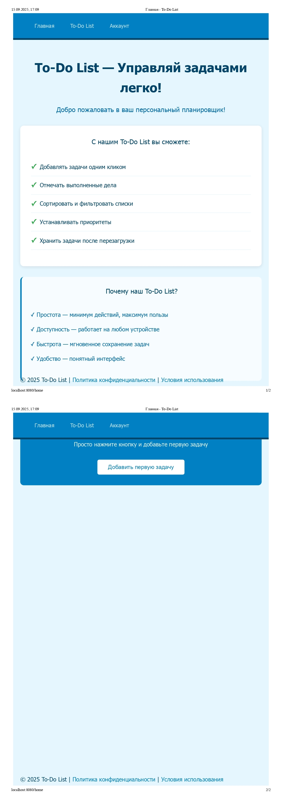
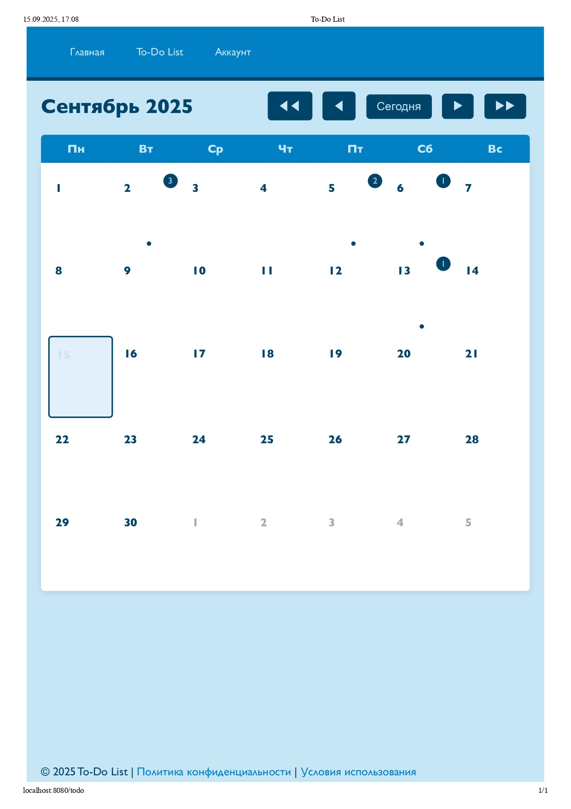
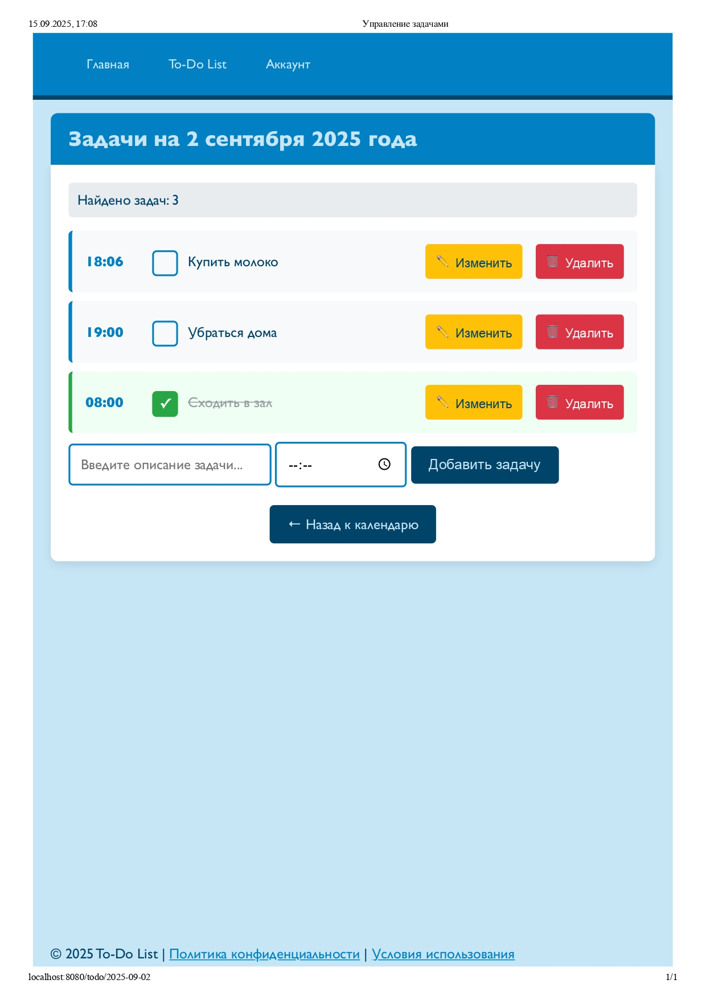
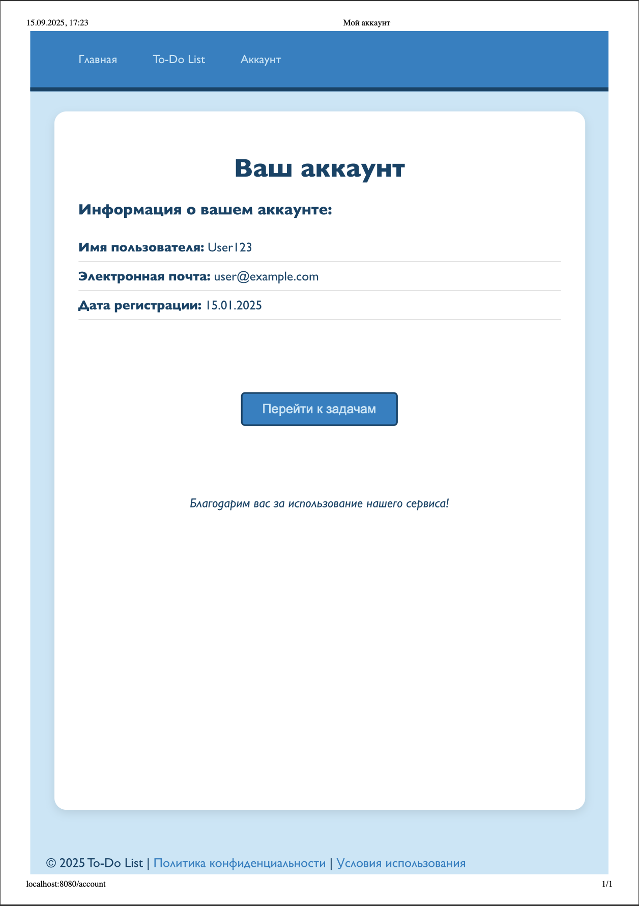

# To-Do List — Управление задачами с календарём

## 📌 Описание проекта
Веб-приложение для организации личных дел и планирования задач.  
Приложение предоставляет удобный календарь, список задач по дням и страницу аккаунта.  
Пользователь может добавлять, изменять, отмечать и удалять задачи.

## ⚙️ Технологии
- **Backend:** Java 17+, Spring Boot  
- **Frontend:** Thymeleaf, HTML5, CSS3, JavaScript  
- **Хранение данных:** Spring Data JPA (`TaskRepository`)  
- **Сборка:** Maven / Gradle  

## 🗂 Структура проекта
- `TodoApplication.java` — точка входа в приложение.  
- `TaskController.java` — контроллер для операций с задачами.  
- `MainController.java` — контроллер для маршрутов главной, календаря и аккаунта.  
- `TaskService.java` — бизнес-логика для работы с задачами.  
- `TaskRepository.java` — репозиторий для доступа к данным.  
- `TaskTask.java`, `TaskId.java` — сущности модели задачи.  
- `resources/templates/` — фронтенд (HTML/Thymeleaf):
  - `home.html` — главная страница.  
  - `todo.html` — календарь.  
  - `task_of_day.html` — задачи выбранного дня.  
  - `account.html` — аккаунт пользователя.  

## 💻 Интерфейс
Примеры интерфейса (скриншоты рекомендуется хранить в папке `images/`):

```
project/
├── README.md
├── images/
│   ├── home.png
│   ├── todo.png
│   ├── task_of_day.png
│   └── account.png
```

Их можно подключить так:

```md




```

## 🚀 Запуск проекта
1. Склонируйте репозиторий:
   ```bash
   git clone git@github.com:ekpinn/todo.git
   cd todo
   ```
2. Соберите и запустите приложение:
   ```bash
   ./mvnw spring-boot:run
   ```
   или
   ```bash
   ./gradlew bootRun
   ```
3. Откройте в браузере:
   ```
   http://localhost:8080
   ```

## 🔗 Основные эндпоинты
- `GET /home` — главная страница.  
- `GET /todo` — календарь задач.  
- `GET /todo/{dayId}` — задачи конкретного дня.  
- `POST /task_of_day/{dayId}/add` — добавление задачи.  
- `POST /task_of_day/{dayId}/edit/{id}` — редактирование задачи.  
- `POST /task_of_day/{dayId}/delete/{id}` — удаление задачи.  
- `POST /task_of_day/{dayId}/toggle/{id}?completed=true/false` — изменение статуса выполнения.  
- `GET /api/tasks/count?year=&month=&day=` — количество задач на день (для календаря).  
- `GET /account` — страница аккаунта.  
